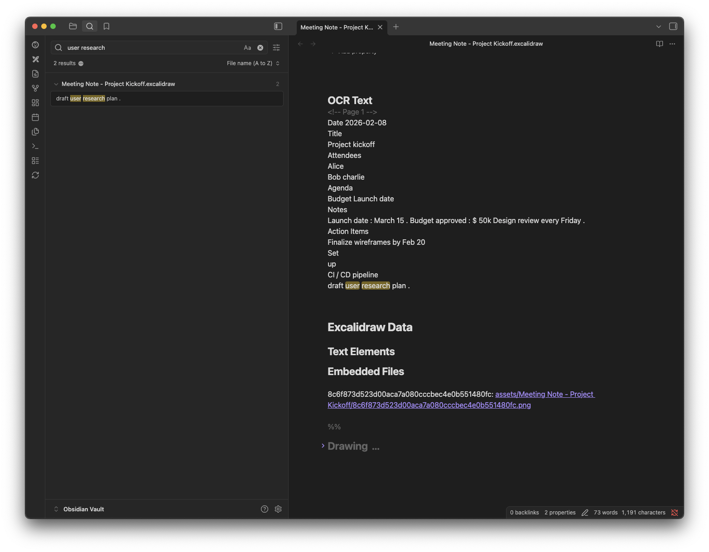
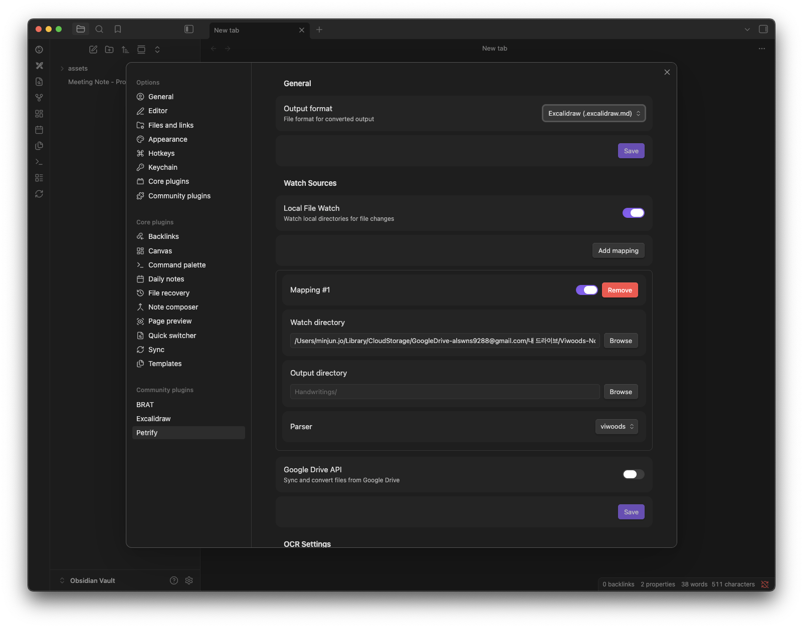
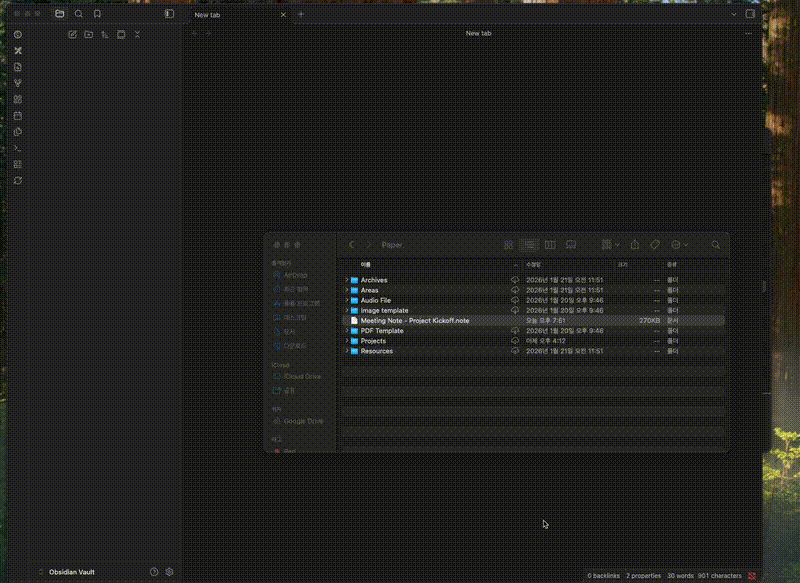

# Petrify

Convert handwritten notes to Excalidraw or Markdown with OCR support to unify your knowledge base.

## Introduction

Petrify converts handwritten note files into [Excalidraw](https://github.com/zsviczian/obsidian-excalidraw-plugin) or Markdown format within Obsidian, with OCR that makes handwriting searchable. In Excalidraw format, your handwriting is preserved as-is on the canvas, where you can annotate with text, arrows, highlights, and links.

> [Viwoods](https://www.viwoods.com/) is a handwriting note app for e-ink tablets (e.g. Viwoods AiPaper). Petrify reads the `.note` format exported by this app.

**Currently supported:**
- Parser: Viwoods (.note), PDF (.pdf)
- OCR: Tesseract.js (local), Google Cloud Vision (API)
- Output: Excalidraw (.excalidraw.md), Markdown (.md)
- Watcher: chokidar (local filesystem), Google Drive API (remote change detection)

**Planned:**
- Additional parsers for other handwriting note apps


## Why Petrify

Sometimes a pen is the most natural way to capture your thoughts — sketching diagrams, jotting quick notes in a meeting, or writing freely without the constraints of a keyboard. Other times, typing is faster and more structured. If you use both, your knowledge inevitably splits in two: handwritten notes on your e-ink tablet, and typed notes in Obsidian.

The usual workaround — syncing handwriting files to Google Drive and opening them as PDFs — keeps your notes accessible but isolated. Handwriting exported as PDF is just a flat image — it can't be searched, linked, or tagged alongside your Obsidian notes. Your handwriting becomes dead data, locked away from search, graph view, and backlinks.

Petrify bridges this gap. It converts handwritten note files into Excalidraw or Markdown inside your vault, with OCR that makes the content searchable. The result is one vault, one knowledge base — regardless of whether you picked up a pen or a keyboard.

This matters even more as personal AI assistants like [OpenClaw](https://github.com/openclaw/openclaw) become mainstream. A unified knowledge base means your AI can draw from everything you've written — handwritten or typed — to give more personalized answers.

Petrify currently supports Viwoods (.note) and PDF (.pdf) files, and its plugin architecture makes it straightforward to add support for other handwriting apps in the future.
With the PDF parser, you can sync and convert notes from any device that supports PDF export by selecting the `pdf` parser in your mapping.

## Obsidian Plugin

### Installation

This plugin is not yet published in the Obsidian Community Plugin directory.

#### Option 1: BRAT (Recommended)

1. Install the [BRAT](https://github.com/TfTHacker/obsidian42-brat) plugin
2. Open BRAT settings → "Add Beta plugin"
3. Enter repository URL: `jo-minjun/petrify`
4. Click "Add Plugin"

#### Option 2: Build from Source

```bash
git clone https://github.com/jo-minjun/petrify.git
cd petrify
pnpm install
pnpm build
```

Then copy the build output to your vault:

```bash
mkdir -p <vault>/.obsidian/plugins/petrify/
cp packages/obsidian-plugin/main.js <vault>/.obsidian/plugins/petrify/
cp packages/obsidian-plugin/manifest.json <vault>/.obsidian/plugins/petrify/
cp packages/obsidian-plugin/worker.min.js <vault>/.obsidian/plugins/petrify/
cp -r packages/obsidian-plugin/tesseract-core <vault>/.obsidian/plugins/petrify/
```

Restart Obsidian and enable **Petrify** in Settings > Community Plugins.

### Features

- **Output format**: Excalidraw (`.excalidraw.md`) or Markdown (`.md`) — Excalidraw format requires the [Excalidraw plugin](https://github.com/zsviczian/obsidian-excalidraw-plugin)
- **File watching**: Watch external folders and automatically convert new or updated files
- **Multi-folder mapping**: Map multiple external folders to different vault folders, each with its own parser
- **Drag & drop**: Drop handwriting files into the file explorer to convert them at the drop location
- **Sync command**: Manually trigger a full sync via the ribbon icon or command palette (`Petrify: Sync`)
- **OCR**: Extract handwritten text so your notes become searchable in Obsidian
  
- **Duplicate prevention**: Skips already-converted files by comparing modification time
- **Source delete sync**: Optionally remove converted files when the source file is deleted
- **Keep protection**: Mark converted files as protected via frontmatter (`keep: true`) to prevent deletion or re-conversion — toggle via command palette or file context menu

### Settings



#### Output

| Setting | Description |
|---------|-------------|
| Output format | Output file format (Excalidraw / Markdown) |

#### Watch Sources — Local File Watch

| Setting | Description |
|---------|-------------|
| Local file watch | Enable/disable local directory watching |
| Watch directory | External folder path to watch (with Browse button) |
| Output directory | Vault path for converted files (with Browse button) |
| Parser | Parser to use (Viwoods / PDF) |

Multiple mappings can be added, each with its own watch/output directory and parser.

#### Watch Sources — Google Drive API

| Setting | Description |
|---------|-------------|
| Google Drive API | Enable/disable Google Drive integration |
| Client ID | OAuth2 client ID from Google Cloud Console |
| Client secret | OAuth2 client secret from Google Cloud Console |
| Authentication | Authenticate with Google account |
| Auto polling | Automatically poll for changes |
| Poll interval | Minutes between polling (1–60, default: 5) |
| Folder | Google Drive folder to watch (via Browse button) |
| Output directory | Vault path for converted files |
| Parser | Parser to use (Viwoods / PDF) |

#### OCR

| Setting | Description |
|---------|-------------|
| OCR provider | OCR engine (Tesseract / Google Vision) |
| Google Vision API key | API key for Google Cloud Vision (shown when Google Vision is selected) |
| Language hints | Preferred languages for recognition (Korean, English, Japanese, Simplified Chinese, Traditional Chinese) |
| Confidence threshold | Minimum OCR confidence (0–100, default: 50) |

> **Google Vision API free tier:** Google Cloud Vision offers 1,000 free units per month. Petrify uses one unit per page, so you can OCR up to **1,000 pages/month at no cost**. See [Cloud Vision pricing](https://cloud.google.com/vision/pricing) for the latest details.

### Drag & Drop



Drag and drop handwriting files (.note, .pdf) into the file explorer to create converted files at the drop location.

- Only supported extensions are processed; others fall through to Obsidian's default behavior
- If multiple parsers match the same extension, a selection modal is shown
- "Apply to all" option to batch-apply the same parser to files with the same extension
- Drop-converted files are protected from auto-deletion

### Google Drive

There are two ways to integrate Google Drive handwriting files:

#### Option 1: Google Drive for Desktop (local sync)

If you use Google Drive for Desktop to sync your handwriting files locally, you can point a Watch Directory at the synced folder for automatic conversion.

1. Install [Google Drive for Desktop](https://www.google.com/drive/download/)
2. Set up local sync for the Google Drive folder containing your handwriting files
3. Set the synced local path as a Watch Directory in Petrify settings
   - macOS: `~/Library/CloudStorage/GoogleDrive-<account>/My Drive/<folder>`
   - Windows: `G:\My Drive\<folder>` (drive letter may vary)

#### Option 2: Google Drive API (when virtual drive mounting is not available)

If virtual drive mounting is blocked (e.g. corporate policy), the Google Drive API adapter detects changes and downloads files directly via API.

Each user needs their own Google Cloud OAuth credentials:

1. Create a Google Cloud project and enable the Google Drive API
2. Configure the OAuth consent screen (External, add your Google account as a test user)
3. Create an OAuth 2.0 Client ID (Desktop app type) in **APIs & Services > Credentials**
4. In Petrify settings, enable **Google Drive API** and enter Client ID / Client Secret
5. Click **Authenticate** → sign in with Google in the browser
6. After redirect to `localhost`, copy the entire URL from the address bar and paste it into the Obsidian modal
7. Click **Add mapping** → **Browse** to select a Google Drive folder
8. Set the output directory and parser → **Save**

**Key features:**
- Polling via Google Drive Changes API (configurable: 1–60 min)
- Direct binary download via API — no local file sync required
- Automatic session restore via OAuth refresh token

### Network usage

By default, this plugin does not make any network requests. Network features (Google Drive, Cloud Vision) are only active when explicitly enabled in settings.

- **Tesseract.js (OCR)**: On first use with the Tesseract provider, language data files (~15 MB per language) are downloaded from the [petrify GitHub releases](https://github.com/jo-minjun/petrify/releases) and cached locally. Once downloaded, all OCR processing happens entirely on your device. No image data is sent to external servers.
- **Google Cloud Vision API**: When selected as OCR provider, images are sent to Google servers for text recognition. Requires a user-provided API key.
- **Google Drive API**: When Google Drive integration is enabled, the plugin communicates with Google servers to list and download files. Requires OAuth2 authentication.

### Data access

This plugin reads files from directories **outside your Obsidian vault**. Specifically:

- **Local file watch**: Reads handwriting files from external directories you configure in settings. Only the configured watch directories are accessed.
- **Google Drive**: Downloads files from your Google Drive folders via API.

All configured directory paths are stored in the plugin's local data file within your vault. Sensitive data (OAuth tokens, API keys, client secrets) are stored via Obsidian's SecretStorage API, which provides OS-level encryption.

### Requirements

- Obsidian 1.11.4+
- [Excalidraw plugin](https://github.com/zsviczian/obsidian-excalidraw-plugin) (when using Excalidraw output format)
- Desktop only (requires Node.js filesystem access)

## License

MIT

## Contributing

For development setup, architecture, and package structure, see [CONTRIBUTING.md](./CONTRIBUTING.md).
